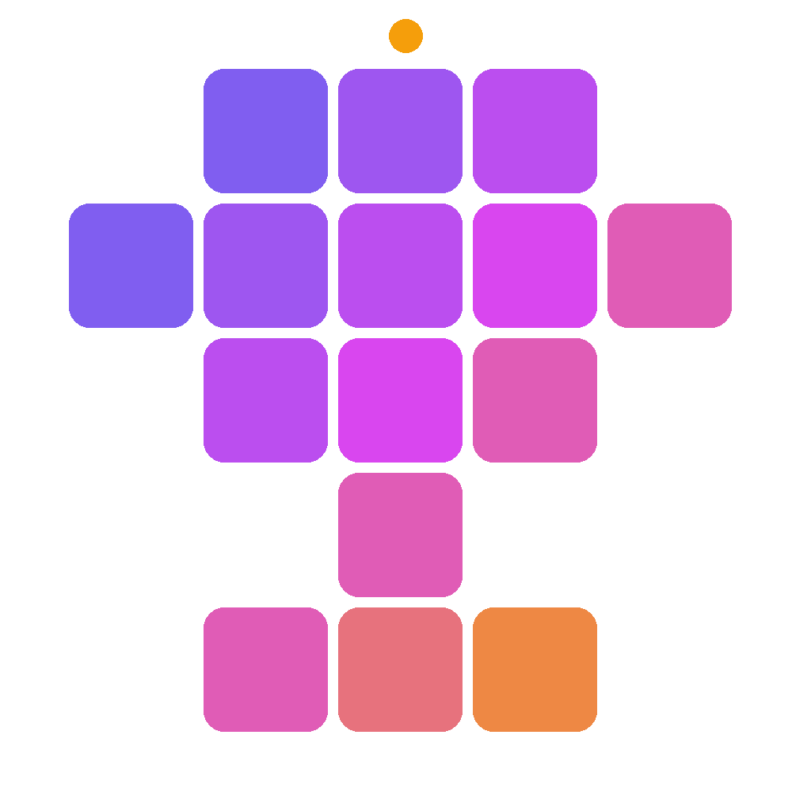

<div align="center">



# PixelForge Studio

### Peşəkar şəkil çevirici, ölçü dəyişdirici və sıxışdırıcı

_"Hər pikseli ustalıqla emal et."_

[](https://www.python.org/)
[](LICENSE)
[](https://github.com/TomSchimansky/CustomTkinter)
[](#test-etmək)

</div>

---

## ✨ Niyə PixelForge Studio?

- 🎨 **Tam Azərbaycan dilində interfeys** — tərcümə deyil, doğmadır.
- 🗜 **Hədəfli sıxışdırma** — şəkilləri **200 KB** (və ya seçdiyiniz hər hansı ölçüyə) qədər deterministik şəkildə kiçildir.
- 🪄 **Tam format çevirmə matrisi** — JPG ↔ PNG ↔ WEBP ↔ GIF ↔ BMP ↔ TIFF ↔ ICO (HEIC oxuma).
- 📐 **Çevik ölçü dəyişdirmə** — piksel, faiz, uzun/qısa tərəf rejimləri.
- 🚀 **Toplu emal** — yüzlərlə şəkil paralel olaraq, UI donmadan.
- 📜 **Canlı log paneli** — proqramın gördüyü hər iş şəffaf şəkildə görünür.
- 🌈 **Müasir, parlaq UI** — CustomTkinter, qradient brend, tünd və açıq mövzu.

---

## 🚀 Sürətli başlanğıc

### Tələblər
- Python **3.11** və ya yuxarı
- Windows 10/11, macOS 12+, və ya Linux

### Quraşdırma

```bash
git clone https://github.com/goshgarhasanov/pixelforge-studio.git
cd pixelforge-studio
pip install -r requirements.txt
```

### İşə salma

```bash
python -m pixelforge
```

> **Dövrü** ilk dəfə açdıqda `output/` qovluğu avtomatik olaraq layihənin yanında yaradılır — bütün emal nəticələri ora yığılır.

---

## 🖼 Necə istifadə olunur?

1. **Şəkilləri sürükləyib boş zonaya** buraxın (və ya `Fayl əlavə et` düyməsinə klikləyin).
2. Sağdakı **Tənzimləmələr** panelindən çıxış formatı, ölçü rejimi və hədəf KB seçin.
3. **`İndi emal et`** düyməsinə klikləyin.
4. `output/` qovluğunda hazır şəkilləri tapın.

---

## ⚙ Funksiyalar

### 🪄 Çevirmə (Convert)
Tam dəstəklənən çıxış format-ları: **JPG, PNG, WEBP, GIF, BMP, TIFF, ICO**.
Giriş üçün əlavə olaraq **HEIC / HEIF** də oxunur.

| Mənbə → Hədəf | JPG | PNG | WEBP | GIF | BMP | TIFF | ICO |
|:---:|:---:|:---:|:---:|:---:|:---:|:---:|:---:|
| **JPG** / PNG / WEBP / GIF / BMP / TIFF / HEIC | ✅ | ✅ | ✅ | ✅ | ✅ | ✅ | ✅ |

- Şəffaflığı dəstəkləməyən format-lara çevirdikdə avtomatik arxa fon doldurulur.
- ICO çıxışı çoxölçülü ikon (16/32/48/64/128/256) yaradır.
- EXIF avtomatik rotasiya — şəkillər həmişə düzgün istiqamətdə.

### 📐 Ölçü dəyişdirmə (Resize)
- **Dəyişmə** (yalnız çevir/sıxışdır)
- **Piksel** (en × hündürlük)
- **Faiz** (məs. 50%)
- **Uzun tərəf** / **Qısa tərəf**
- Tərəflər nisbəti avtomatik qorunur. Ölçü artırma standart olaraq qadağandır.

### 🗜 Sıxışdırma (Compress)
Deterministik **binary search** alqoritmi:
1. EXIF rotasiyası tətbiq olunur.
2. JPEG / WEBP keyfiyyəti `[35, 95]` aralığında ≤ 8 təkrarda axtarılır.
3. Hədəf qarşılanmırsa, şəkil 95% addımla kiçildilir — qısa tərəf 320 px-dən aşağı düşənə qədər.
4. Hədəf 2% tolerans ilə zəmanətlə qarşılanır.

---

## 🧪 Test etmək

```bash
pip install -r requirements-dev.txt
python -m pytest tests/
```

Cari vəziyyət: **23/23 test keçir** (compressor, converter, resizer, pipeline).

---

## 📁 Layihə strukturu

```
pixelforge-studio/
├── src/pixelforge/
│   ├── core/           # Şəkil emalı alqoritmləri
│   ├── ui/             # CustomTkinter vidcetləri
│   ├── workers/        # Fon emal thread-ləri
│   ├── utils/          # Köməkçi modullar
│   ├── app.py          # Tətbiq başladıcı
│   ├── config.py       # İstifadəçi tənzimləmələri
│   ├── i18n.py         # AZ/TR/EN tərcümələri
│   └── logger.py       # Loglama (dövrü fayl + UI)
├── tests/              # Pytest test-ləri
├── assets/logo/        # Loqo və ikonlar
├── output/             # Standart çıxış qovluğu
└── logs/               # Tətbiq logları (dövrü, 5 MB × 5)
```

---

## 🎨 Brend

| Element | Dəyər |
|---|---|
| Əsas qradient | Indigo `#6366F1` → Fuchsia `#D946EF` → Amber `#F59E0B` |
| Aksent | Cyan, Lime, Coral, Sunflower, Violet |
| Tünd fon | `#0B0B12` → `#1B1B26` |
| Şrift | Segoe UI / Inter, mətnlər üçün; Consolas, loglar üçün |

---

## 🤝 Töhfə vermək

İstənilən təklif, bug bildirişi və ya pull request gözlənilir.
Kod stili: **ruff + black**, tip yoxlaması: **mypy --strict**.

```bash
ruff check src tests
black --check src tests
mypy src
```

---

## 📜 Lisenziya

[MIT](LICENSE) © 2026 PixelForge Studio
